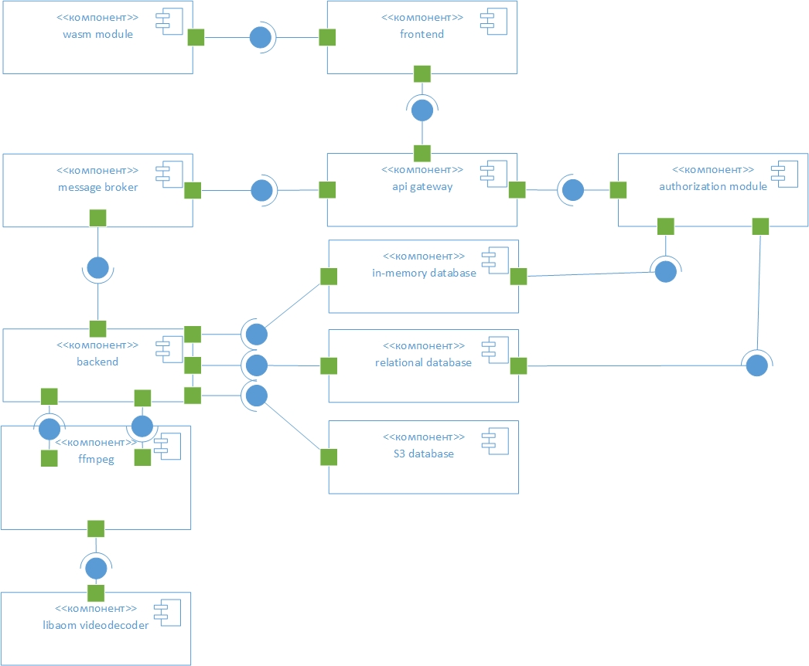
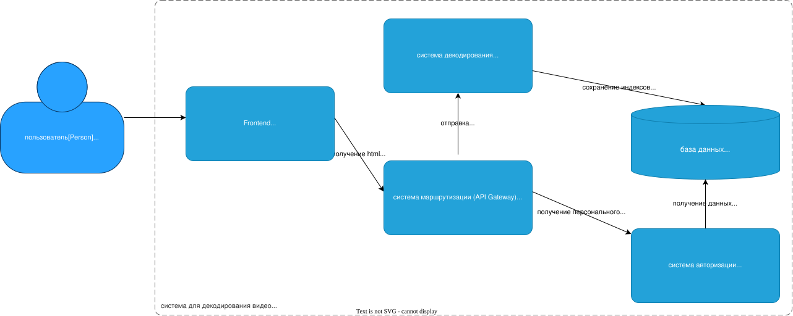
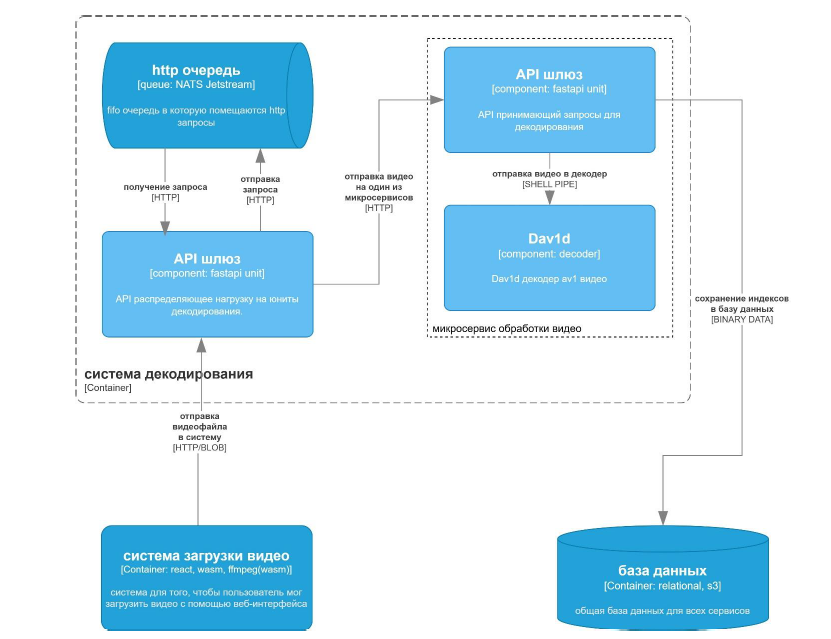

# архитектура

## real

## imaginary
архитектура для проекта -- адаптированная с другого моего проекта, диплома, см. https://www.hse.ru/edu/vkr/1160980265, https://github.com/ressiwage/UFAV1VDS. Схемы неадаптированы. Эта архитектура позволит обеспечить превосходную линейную масштабируемость потому что это -- её суть. Также можно добавить по мере роста запросов автоскалирование с автопокупкой серверов.

Архитектура состоит из 4 важных блоков: frontend, gateway, common-api, decoder-api.

- decoder-api -- артефакт прошлой работы, мысленно заменим его на ml-api.

ml-api -- контейнер с тяжелыми вычислениями. 
это линейно масштабируемый контейнер который уведомляет gateway о своей загрузке, в частности оперативная память и gpu/cpu.

- gateway - универсальный прокси.

это универсальный прокси и балансировщик, который направляет ...-bound запросы на наименее занятыйы ml-api, а бизнес-запросы к бд -- на лёгкое common-api. в случае если нет свободных серверов ml-api, запрос попадает в очередь nats jetstream, откуда выходит по мере разблокировки серверов по принципу fair-queue. 

в случае доработки проекта пользователю показывается длина очереди перед ним, в очередь попадают запросы к llm и операторам если операторов нет.

- common-api - скучнейший контейнер, обычный REST API в одном экземпляре.

- frontend - фронтенд с оптимизациями.

- базы данных

из оригинального проекта убираем S3, так как нам незачем хранить блобы.

## real
на данный момент имеем простое приложение на FastAPI. оно использует 2 модели: искатель и классификатор, а также отправляет запросы на апи клода. Вначале идет оценка запроса по классификатору по категориям 0-4, где 0,1,2 -- тривиальные некритичные. 

критичные сразу отправляются оператору, тривиальные -- сначала производятся поиски с порогом 0.9 и 0.7. если найдены результаты 0.9 -- сразу выдаётся ответ, если только 0.7 -- отправляется RAG запрос клоду, на демонстрации видно.